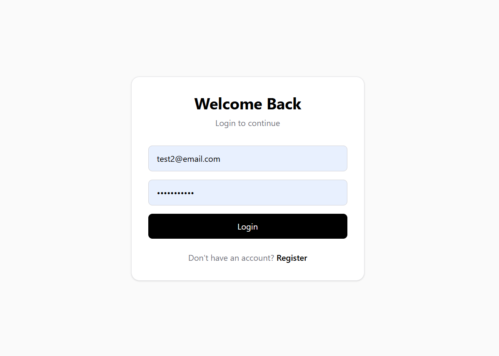
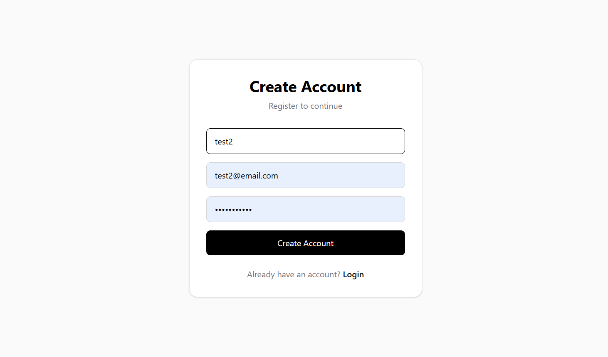
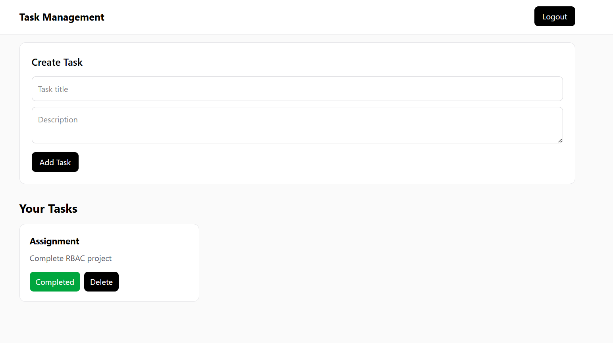
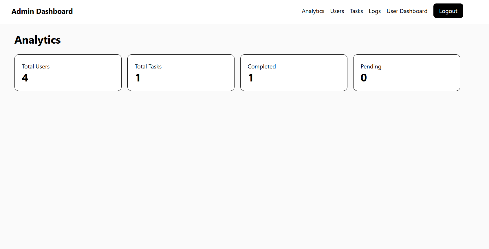
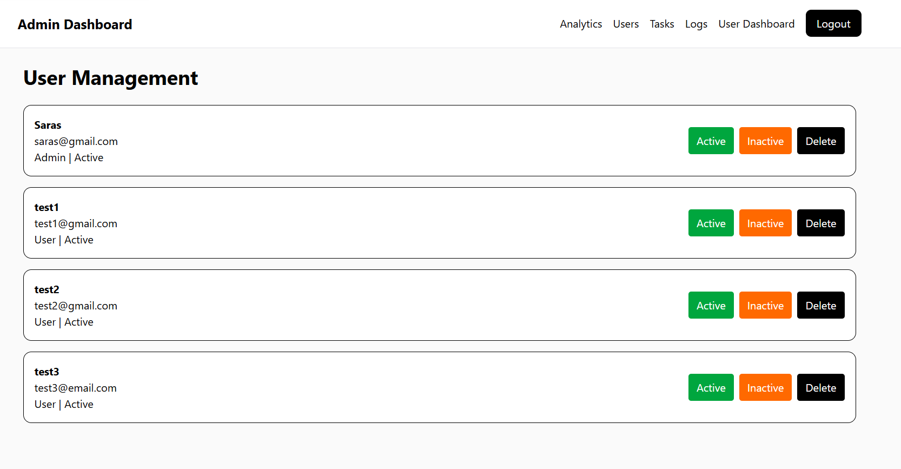
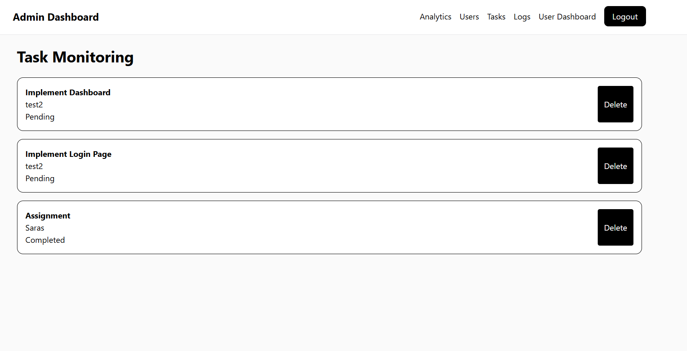
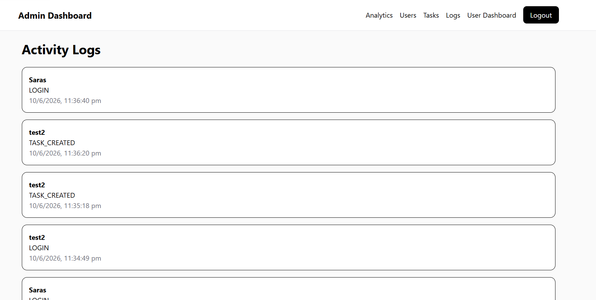

# Task Management System with Role-Based Access Control (RBAC)

## Overview

A full-stack MERN application that implements Role-Based Access Control (RBAC), Activity Logging, Task Management, and Admin Dashboard functionality.

The application allows users to manage their own tasks while providing administrators with advanced monitoring and management capabilities.

---

## Features

### Authentication

* User Registration
* User Login
* JWT Authentication
* Password Hashing using bcryptjs
* Protected Routes

### User Features

* Create Tasks
* View Own Tasks
* Update Own Tasks
* Delete Own Tasks
* Logout

### Admin Features

* View All Users
* Update User Status (Active / Inactive)
* Delete Users
* View All Tasks
* Delete Any Task
* View Activity Logs
* View Analytics Dashboard

### Activity Logging

Tracks:

* User Login
* Task Creation
* Task Updates
* Task Deletion
* User Status Changes
* User Deletion
* Admin Task Deletion

### Analytics Dashboard

Displays:

* Total Users
* Total Tasks
* Completed Tasks
* Pending Tasks

---

## Tech Stack

### Frontend

* React
* React Router DOM
* Axios
* Tailwind CSS v4
* React Hot Toast

### Backend

* Node.js
* Express.js
* MongoDB
* Mongoose
* JWT (jsonwebtoken)
* bcryptjs

---

## Project Structure

```text
task-management-rbac
│
├── backend
│   ├── config
│   ├── controllers
│   ├── middleware
│   ├── models
│   ├── routes
│   ├── utils
│   └── server.js
│
├── frontend
│   ├── src
│   │   ├── api
│   │   ├── components
│   │   ├── context
│   │   ├── pages
│   │   └── routes
│
└── README.md
```

---

## Installation

### Clone Repository

```bash
git clone <your-repository-url>
```

---

### Backend Setup

```bash
cd backend

npm install

npm run dev
```

---

### Frontend Setup

```bash
cd frontend

npm install

npm run dev
```

---

## Environment Variables

Create a `.env` file inside the backend folder:

```env
PORT=3001

MONGO_URI=your_mongodb_connection_string

JWT_SECRET=your_secret_key
```

---

## API Endpoints

### Authentication

| Method | Endpoint           |
| ------ | ------------------ |
| POST   | /api/auth/register |
| POST   | /api/auth/login    |

### Tasks

| Method | Endpoint       |
| ------ | -------------- |
| GET    | /api/tasks     |
| POST   | /api/tasks     |
| PUT    | /api/tasks/:id |
| DELETE | /api/tasks/:id |

### Admin

| Method | Endpoint                    |
| ------ | --------------------------- |
| GET    | /api/admin/users            |
| DELETE | /api/admin/users/:id        |
| PATCH  | /api/admin/users/:id/status |
| GET    | /api/admin/tasks            |
| DELETE | /api/admin/tasks/:id        |
| GET    | /api/admin/activity-logs    |
| GET    | /api/admin/analytics        |

---

## Screenshots

### Login Page



---

### Register Page



---

### User Dashboard



---

### Admin Dashboard



---

### User Management



---

### Task Monitoring



---

### Activity Logs



---

## Role-Based Access Control

### User Permissions

* Create Own Tasks
* View Own Tasks
* Update Own Tasks
* Delete Own Tasks

### Admin Permissions

* View All Users
* Manage Users
* View All Tasks
* Delete Any Task
* View Activity Logs
* View Analytics

---

## Author

**Saras Mishra**

Full Stack MERN Application developed as part of a role-based access control assignment.
